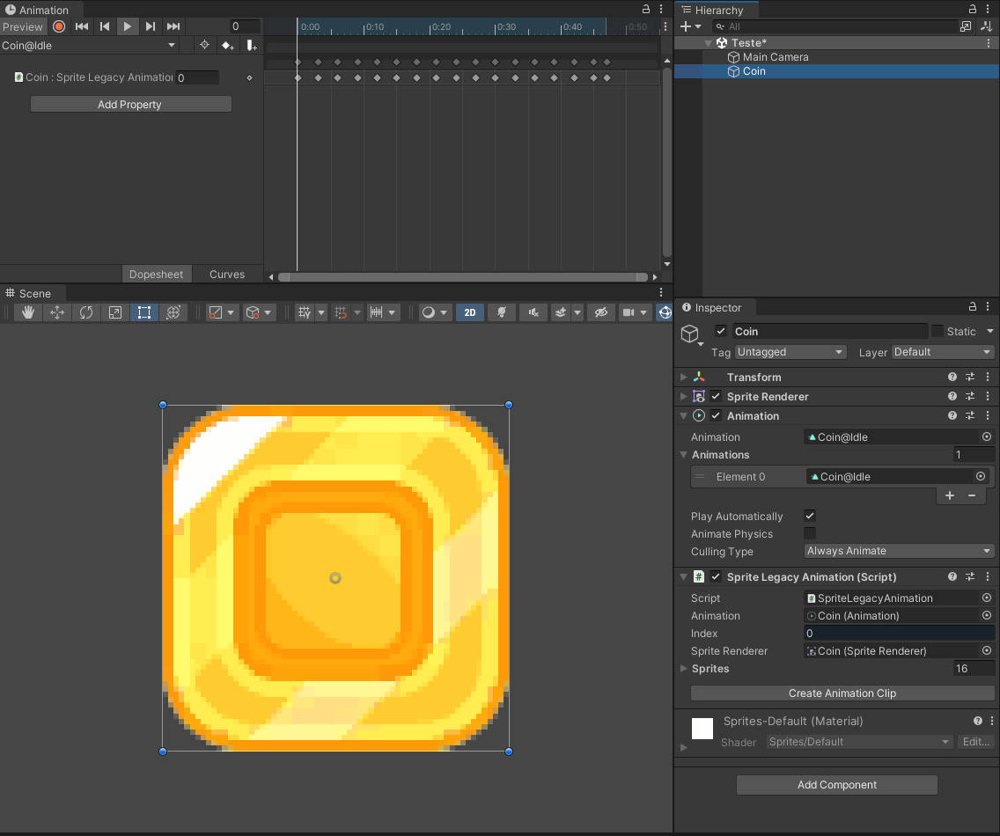

# Sprite Legacy Animation

* Use Sprites in Legacy Animations
* Unity minimum version: **2021.2**
* Current version: **1.2.0**
* License: **MIT**

## Summary

Sprite animation is only supported by the new Mecanim Animation System. While this system is good, sometimes we just want to play a simple Sprite animation for some GameObject. Using Mecanim, you have to create an AnimationController and an AnimationClip assets, setting this clip to play on the controller. There are too much steps to play just one single animation clip.

Nowadays, the main advantage of the Legacy Animation System is simplicity: just create the Animation Clip asset and play it using the Animation component. The downside is that this system was not implemented to change references types, like swapping sprites from a SpriteRenderer component.

This package overcomes this problem. With it, Sprites animations can be previewed and played both on Editor and Runtime, using a SpriteRenderer or Image component.

## How To Use

Depending where you want the Sprite animation to be played, you have two options:

1. In a **SpriteRenderer**: use the **SpriteLegacyAnimation** component
2. In an **Image**: use the **ImageLegacyAnimation** component

After setting the *Sprites* array property, you can create a legacy Animation Clip asset by clicking on the **Create** button next to it. Select how many frames between each Sprite before create the animation asset.

Open the Animation window and preview your animation.



Note that the animation is done by animating the *Index* property inside the SpriteLegacyAnimation or ImageLegacyAnimation components.

### Utilities

- **DisableAfterAnimationFinish**: component which disables the GameObject after the local Animation component finishes to play.
- Animation extension function **PlayAndWait**: returns a Coroutine which plays the default (or a given one) animation from an Animation component and waits until it finishes.

## Installation

### Using the Package Registry Server

Follow the instructions inside [here](https://cutt.ly/ukvj1c8) and the package **ActionCode-Sprite Legacy Animation** 
will be available for you to install using the **Package Manager** windows.

### Using the Git URL

You will need a **Git client** installed on your computer with the Path variable already set. 

- Use the **Package Manager** "Add package from git URL..." feature and paste this URL: `https://github.com/HyagoOliveira/SpriteLegacyAnimation.git`

- You can also manually modify you `Packages/manifest.json` file and add this line inside `dependencies` attribute: 

```json
"com.actioncode.sprite-legacy-animation":"https://github.com/HyagoOliveira/SpriteLegacyAnimation.git"
```

---

**Hyago Oliveira**

[GitHub](https://github.com/HyagoOliveira) -
[BitBucket](https://bitbucket.org/HyagoGow/) -
[LinkedIn](https://www.linkedin.com/in/hyago-oliveira/) -
<hyagogow@gmail.com>
